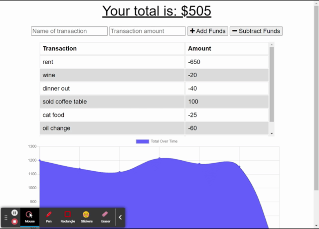

# budget-app

## Description 
This application is a budget tracker meant to help keep an accurate record of the users spending. This app functions online as well as offline so that users may not worry if their internet connection is unstable. This app is an PWA and can be installed on the user's device.

## Installation
In order to use this app please go to the link provided:

https://cash-stash.herokuapp.com/

## Usage
Once on the webpage the user can add their initial budget by typing it in and clicking **+ ADD FUNDS** *(as well as any future additions of income)*. Then for each transaction the user makes, they should type it in the box and click **- SUBTRACT FUNDS**. The user will see their balance, a record of transactions, and a graph showing their income and spending trends on the page every load.

## Credits
I was able to build this project based off information acquired during class and with class provided code.